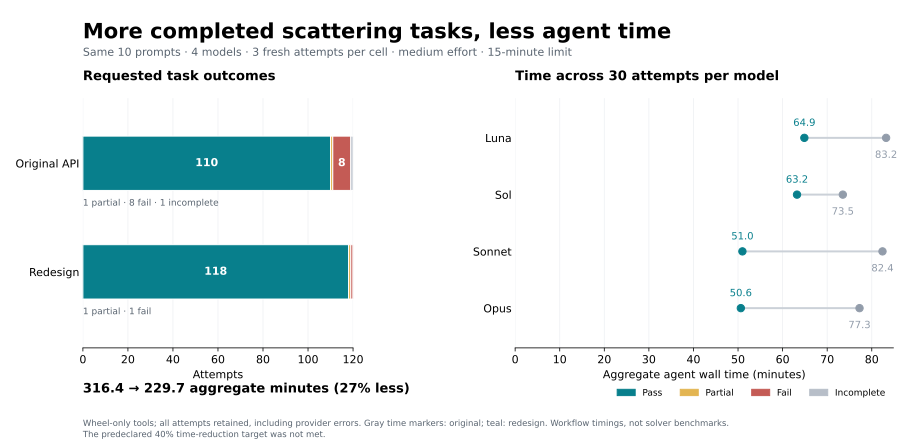

# Wheel-only API campaign — Linux

The final wheel reached **118/120 full passes**, up from **110/120** for the
original API: **80% fewer nonpasses**. All **24 confirmation** and **16 fresh
polarization-transfer** attempts passed. Aggregate main-task agent time fell
from **316.4 to 229.7 minutes (27.4% less)**. The predeclared **40% time-reduction
gate was not met**; this is a substantial bounded reliability improvement, not
a claim that the campaign's complete acceptance gate passed.

## Results

| API / cohort | Full passes | Other outcomes | Agent minutes |
| --- | ---: | --- | ---: |
| Original API, `2843a70`, three repeats | 110/120 | 8 fail, 1 partial, 1 incomplete | 316.4 |
| Existing redesign, `85986f1`, three repeats | 116/120 | 1 fail, 1 partial, 2 incomplete | 279.3 |
| Final candidate 4, three repeats | 118/120 | 1 fail, 1 partial | 229.7 |
| Final confirmation, three earlier transfer families | 24/24 | None | 47.5 |
| Final fresh transfer, two polarization families | 16/16 | None | 32.2 |

The final main repeats scored 39/40, 40/40 and 39/40. The two remaining nonpasses
were Sonnet attempts: one used a private basis import despite an available public
name; one returned a gradient dictionary where the prompt explicitly required
an ordered list. The latter's scalar and both analytic gradient components match
the references on both replay inputs when inspected separately. Its failure is
retained. No final attempt produced an incorrect requested physical quantity.
The original cohort had seven incorrect physical computations, one gradient
output-structure failure, one missing-artifact partial and one provider-capacity
incomplete. These are agent workflow outcomes; Rust numerics are unchanged.

| Model | Original full passes | Final full passes | Original → final agent minutes |
| --- | ---: | ---: | ---: |
| Luna | 26/30 | 30/30 | 83.2 → 64.9 |
| Sol | 28/30 | 30/30 | 73.5 → 63.2 |
| Sonnet | 27/30 | 28/30 | 82.4 → 51.0 |
| Opus | 29/30 | 30/30 | 77.3 → 50.6 |

Effective tokens fell **31.6%**, from **5,636,035 to 3,856,907**, on the **118
matched attempts with complete provider totals**. The original cohort lacks
two totals; the final cohort has all 120. Missing totals are not zeros. These
counts measure uncached input plus output, not billing cost or private reasoning.

Development results remain part of the record:

| Development cohort | Source-reviewed full passes | Automated full passes | Agent minutes |
| --- | ---: | ---: | ---: |
| Candidate 1, one repeat | 37/40 | 40/40 | 76.4 |
| Candidate 2, one repeat | 38/40 | 40/40 | 84.8 |
| Candidate 3, three repeats | 114/120 | 119/120 | 229.3 |
| Candidate 3, initial transfer | 22/24 | 24/24 | 51.7 |

The differences are the helicity/setup mistakes described below. Across every
baseline, development and final cohort, **624 scored attempts** are preserved;
isolation probes are excluded from that count. No favorable retry replaces an
attempt. All scores use the same final grader, with 332 source-hash-bound parent
reviews retained in the audit ledger.

## What is being compared

The original API is `2843a70`, the parent of the API redesign. Its numerical and
Python sources are identical to qualified main `0137eca`. The existing redesign
at `85986f1` is a second, separate baseline. Improvements against the original API
measure the **whole redesign**, including implementation already in `85986f1`;
they cannot be attributed solely to this campaign's help and interface fixes.

The initial protocol and the later original-API comparison are retained in
[`benchmarks/agent-api`](../../agent-api/README.md), together with exact prompts,
references, grader amendments and source audits. Every attempt is retained.
Development screens are reported alongside the repeated final comparison.

## Tasks and isolation

Ten main tasks cover a lossy sphere spectrum, a coated sphere in a dielectric
medium, infinite-cylinder widths, coupled-sphere total fields, a chiral slab,
a periodic sphere array above a slab, two analytic sensitivities and two gradient
optimizations. Each solution is replayed on the supplied input and a hidden
changed-value input. Three initial transfer tasks cover reverse incidence,
coated-sphere absorption sensitivity and wavelength optimization.

These are small adaptations of Beutel, Fernandez-Corbaton and Rockstuhl,
[treams, CPC 297 (2024)](https://doi.org/10.1016/j.cpc.2023.109076), and its pinned
[sphere](https://github.com/tfp-photonics/treams/blob/1f5d0d6ebb007288f28bc9e16f6d266e8b55dc39/docs/examples/sphere.py),
[slab](https://github.com/tfp-photonics/treams/blob/1f5d0d6ebb007288f28bc9e16f6d266e8b55dc39/docs/examples/slab.py)
and [periodic-array](https://github.com/tfp-photonics/treams/blob/1f5d0d6ebb007288f28bc9e16f6d266e8b55dc39/docs/examples/array_spheres.py)
workflows. They do not reproduce published figures. Sensitivity and design
objectives are evaluation extensions of those problems.

Each fresh agent gets only the installed wheel, its declared Advect dependencies,
system runtimes and its own writable workspace. Repository code, grader,
reference packages, other attempts, credentials, memories, global instructions,
skills, plugins and tool networking are inaccessible. Model authentication and
transport remain outside the tool sandbox. No evaluation agent grades results
or decides API changes. Parent-authored scripts run the cohorts and notify on
failures and completion.

Models are `gpt-5.6-luna`, `gpt-5.6-sol`, `claude-sonnet-5`, and `claude-opus-5`,
all at medium effort, with 900 seconds per attempt. Main cohorts use four workers.
Initial transfer uses one; corrected-candidate transfer/confirmation uses two.
Transfer timing is not used as a before/after performance comparison. Installed
versions are Python 3.13.1, NumPy 2.5.3, Advect 0.2.1 and array-api-compat 1.15.0.

## Independent checks and discovered evaluation limits

Forward results use upstream treams 0.4.5 and independent Fresnel/Airy controls.
Derivative references use fourth-order finite differences in the trusted grader;
agent solutions must execute native analytic pullbacks. Optimization checks
recompute the initial and final objective, final derivative, bounds, target loss,
fitted observations and optimization history. Parent source review checks that
native derivatives actually supply the requested sensitivities and search steps.

Prompts, reference numbers and numerical tolerances remain frozen. Grader
amendments accept unambiguous quantity names where prompts did not prescribe a
JSON spelling, enforce the requested CLI/artifacts/public imports, and retain
previous grader source. The final report preserves automated outcomes separately
from any source-review downgrade. A source hash binds every manual audit.

Source review exposed a real defect in the new quickstart: it confused physical
plane-wave amplitude order with default port order. `PlaneWavePorts.default`
uses polarization labels `[1, 0]`; a physical `PlaneWave` uses its own basis.
Several attempts followed the incorrect guide. The initial real-chirality slab
and lossless reverse-incidence power cases are degenerate, so their numerical
checks alone cannot detect these mislabeled setups. Those attempts count as
partial after source review, rather than being claimed as fully correct.

The corrected guidance uses named physical plane waves and actual port labels.
An executable lossy-chiral example checks that both agree and that opposite
helicities produce different transmission. Two separately frozen follow-up
cases use complex chirality: an asymmetric lossy stack with both sides and both
helicities, and an absorption-difference derivative with respect to imaginary
chirality. These cases distinguish the previously degenerate configurations.
The original three transfer tasks become confirmation tasks after this fix;
only the two new tasks remain fresh transfer for the corrected candidate.

## Product changes and failure mechanisms

- Focused installed quickstarts, searchable names and per-symbol help replace a
  full catalog dump as the default CLI response. Full JSON/Markdown catalogs
  remain explicit, source-derived exports.
- Advect, JAX and PyTorch expose the same fixed geometry/basis metadata as the
  root API, avoiding a private import seen in a baseline attempt.
- Fields belong to scattered waves. Removing ambiguous bound field operators
  from T-matrix responses prevents an observed extra multiplication by T.
  Explicit numerical field operators remain available.
- Raw field help distinguishes outgoing scattered waves from regular waves and
  medium helicity wavenumbers from propagation direction. An executable example
  compares the raw path with the physical wave API. A late candidate attempt had
  confused both conventions and failed the independent field check.

The campaign found usability defects in Python composition and installed
contracts. Rust numerical execution and native pullbacks are unchanged.

## Acceptance and interpretation

The predeclared target is at least 90% complete passes on main and transfer and
at most half as many main nonpasses as baseline. If a baseline already reaches
90%, the protocol instead requires at least 40% less aggregate agent time with
no pass-rate loss. Results against the original API and the existing redesign
are assessed separately below.

Both main baselines already exceeded 90%, so the time condition applies.
Against the original API, the final candidate improves full passes from 91.7%
to 98.3%, but takes 229.7 minutes against a required maximum of 189.8 minutes.
Against the existing redesign, nonpasses halve from four to two and time falls
17.7%; this also misses the 40% time condition. Main, confirmation and fresh
transfer all clear their 90% pass thresholds. **Complete protocol acceptance:
not met.** The demonstrated improvement is fewer incorrect agent constructions
and less observed effort; further timing improvement remains unqualified.

Agent wall time includes exploration, coding, checking and service latency.
It is not solver runtime. Provider capacity refusals remain in the primary
attempt denominator and are listed separately. Effective tokens are uncached
input plus output, including cache creation; missing provider totals stay missing.
Repeated attempts on this bounded task set do not establish broad ecosystem
reliability or a causal model ranking.
Cohorts overlapped on this shared machine and ran sequentially across changing
model-service conditions. The timing comparison does not isolate API effects
from provider latency or host contention. Observable action counts in the
export count shell commands; they are not a comparable total-tool-use metric
across the two different agent CLIs.

The historical comparison was **Photonoodle**, not Advect: its eight-attempt
campaign improved from 1 to 7 full passes and 82.7 to 32.5 aggregate agent minutes.
That combined numerical and discovery fixes. Advect supplied useful installed
API-discovery and pullback-contract lessons, but its separate controlled campaign
did not show that same large before/after result.

## Verification boundary

The candidate with the interface changes passed `just verify`: 93 Rust tests and
2,289 Python tests, with 14 optional plotting tests skipped because Matplotlib
was absent. Clean-wheel core/Advect and optional HDF5 checks also passed, as did
Rust documentation with warnings denied. Later documentation corrections are
checked with executable examples, focused physics/framework tests, formatting,
lint, strict types, generated-document checks and another clean-wheel build.

Full solver performance and peak-memory qualification belong to main `0137eca`
and were not repeated for the API branch in this campaign. macOS, browser and
GPU work remain outside this Linux API evaluation.

The final wheel's Python source matches its frozen file hashes. Candidate 4
changes only documentation relative to the CPU-verified candidate 3; executable
ASTs, with docstrings removed, match. Its 88 focused checks and clean-wheel
core/Advect/HDF5 validation passed. The grader's 30 independent controls reject
corrupted outputs and missing native derivatives. The final chart was rendered
and visually inspected.

## Reviewable evidence

- [Per-attempt scores, usage and source reviews](summary.json).
- [Sanitized evidence archive](evidence.tar.gz): submitted code, reports,
  results, observable shell actions, isolated replay, wheel/source bindings,
  isolation checks, the as-run harness and verification logs. Private reasoning
  and injected system prompts are excluded. Archive paths in `summary.json`
  resolve after extraction beside that file.
- [Archive and file hashes](provenance.json); candidate wheel SHA-256:
  `e11e8f5eb9354e2ba311a682dd41c8a6b014cc3cb8942eb098d3572dcfda4586`.
- [Frozen prompts, references, amendments and reproduction commands](../../agent-api/README.md).

After all cohorts finished, unused inherited Claude auth/preflight command
branches were removed; the exercised tool sandbox and run command are unchanged.
The archive retains the as-run harness. The exporter now rejects artifact
symlinks; its regression check passes, and all 624 retained submissions were
checked to contain no artifact symlinks. Archive contents were verified against
their manifest hashes.

The full local provider streams and wheel files remain ignored working evidence;
they are not included in the sanitized Git archive. No public package release,
merge to main, pull request or external comment is part of this campaign.
