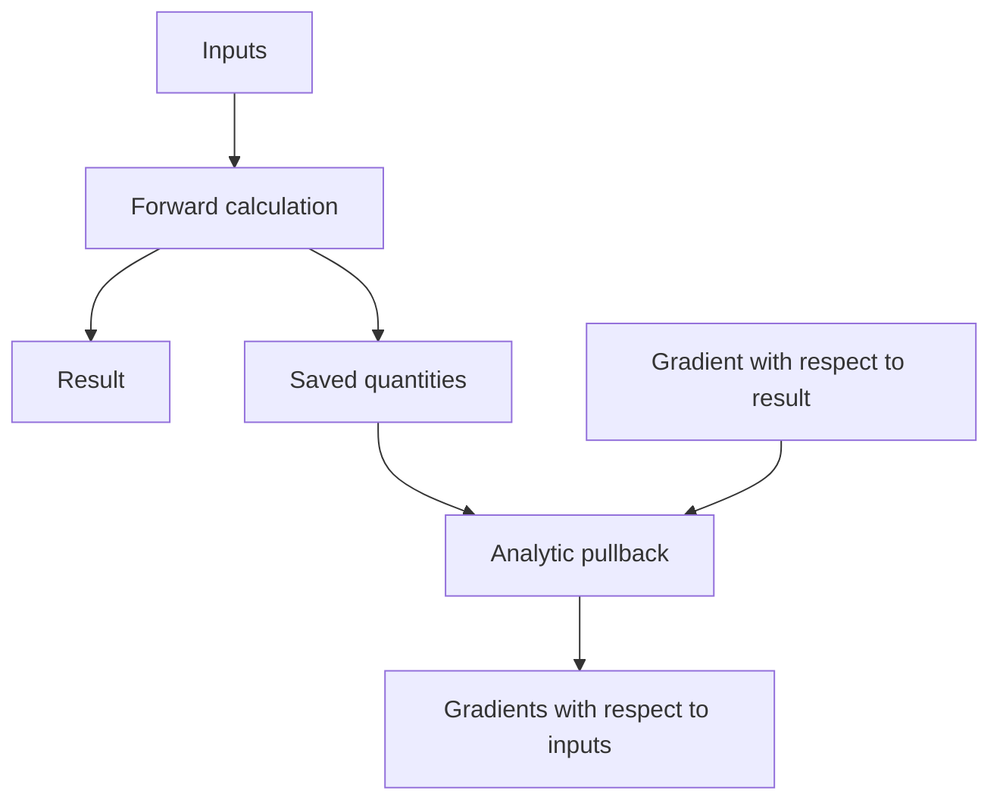

# treams-core

The Rust library computes wave expansions, scattering and analytic gradients.
It has no Python dependency; [treams-py](../treams-py/README.md) connects it to
the Python package.

The calculation layers build on those above them in this table:

| Layer | Modules |
| --- | --- |
| Numerical support | [numerics](src/numerics/README.md), [linalg](src/linalg/README.md), [floating-point control](src/fpenv.rs), [threads](src/threads.rs) |
| Special functions and lattice sums | [special](src/special/README.md), [lattice](src/lattice/README.md) |
| Waves | [spherical](src/sw/README.md), [cylindrical](src/cw/README.md), [plane](src/pw/README.md), [bases](src/basis.rs), [rotations](src/rotation.rs), [periodic channels](src/channels.rs), [vector waves](src/vectorwaves.rs), [fields](src/fields.rs) |
| Particle scattering | [coefficients](src/coeffs/README.md), [T-matrices](src/tmatrix/README.md), [boundary integrals](src/ebcm.rs), [clusters](src/cluster/README.md) |
| Planar scattering | [S-matrices](src/smatrix/README.md) |

Values use double precision. Calculations save the quantities needed to compute
input gradients. These saved quantities form a residual, which connects the two
calculations:

[lib.rs](src/lib.rs) defines conventions and dependency rules.
[Property tests](src/properties/README.md) check physical identities and gradients;
tests beside each implementation check its numerical methods. Run both with
`cargo test -p treams-core`.
