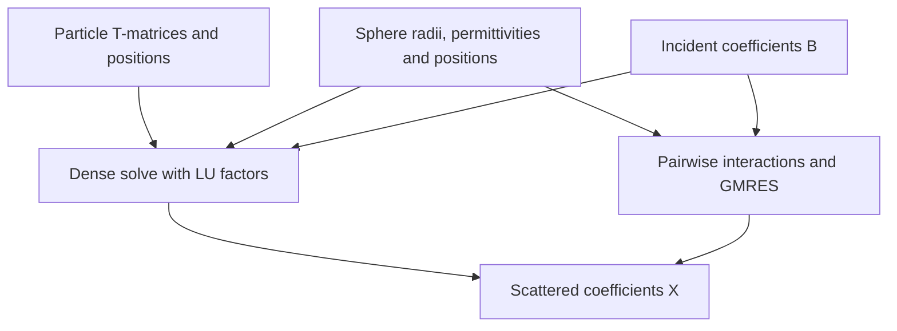

# Particle clusters

This module solves multiple scattering as `(I - T C) X = T B`: particle
T-matrices `T` and translations `C` turn incident coefficients `B` into
scattered coefficients `X`.

- [particles.rs](particles.rs) couples arbitrary spherical or cylindrical
  particle T-matrices.
- [spheres.rs](spheres.rs) builds homogeneous nonmagnetic spheres in vacuum
  and computes gradients of radii, permittivities and positions.
- [interaction.rs](interaction.rs) factors the dense interaction matrix and
  reuses that factorization for different incident fields.
- [iterative.rs](iterative.rs) applies sphere interactions pair by pair and
  solves with GMRES, without storing the full interaction matrix.

Translations come from [sw](../sw/README.md) or [cw](../cw/README.md); solves
use [linalg](../linalg/README.md). Each calculation retains what its analytic
gradient needs. [mod.rs](mod.rs) compares the solver choices.
