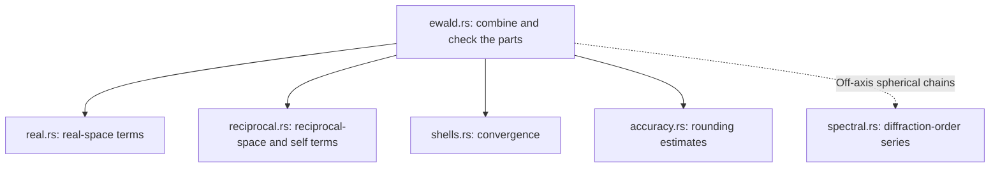

# Lattice sums

This module sums outgoing spherical or cylindrical waves over periodic
lattices and differentiates those sums.

[mod.rs](mod.rs) selects a complete Ewald sum, either Ewald part, or a direct
shell. [inputs.rs](inputs.rs) checks inputs; [cell.rs](cell.rs) and
[geometry.rs](geometry.rs) define the lattice. [ewald.rs](ewald.rs) combines
[real.rs](real.rs) and [reciprocal.rs](reciprocal.rs), with convergence checks
in [shells.rs](shells.rs) and rounding estimates in [accuracy.rs](accuracy.rs).
[reduced.rs](reduced.rs) evaluates reciprocal integrals; [sheets.rs](sheets.rs)
keeps their outgoing-wave branches consistent. [spectral.rs](spectral.rs)
provides diffraction-order series for off-axis spherical chains when Ewald
cancellation loses accuracy. [batch.rs](batch.rs) evaluates arrays.

In the Ewald path, arrows point from a calculation to the helpers it uses:

The Bloch factor is `exp(+i kpar · R)`. Supported wavenumbers, singular
thresholds and derivative conventions are defined in [mod.rs](mod.rs).
