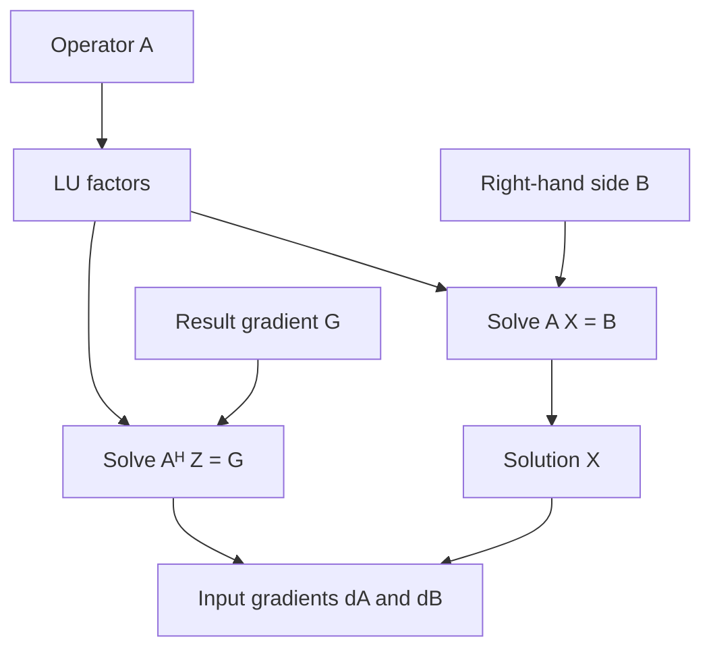

# Linear algebra

This module supplies dense solves, singular values, eigensystems and their
analytic gradients to the scattering calculations.

[mod.rs](mod.rs) stores dense matrices with nalgebra and uses faer to factor
and multiply them without copying their entries. It also defines the saved
factorizations used to differentiate solves. Small fixed-size matrices and
real symmetric eigenproblems stay in nalgebra. Parallel calculations use the
crate's [thread pool](../threads.rs).

The dense solve reuses its LU factors to differentiate `A X = B`. For a result
gradient `G`, the pullback solves `Aᴴ Z = G` and returns `dB = Z`, `dA = -Z Xᴴ`:

[gmres.rs](gmres.rs) solves complex linear systems using only matrix-vector
products. It restarts after a bounded number of vectors and checks the actual
residual `b - A x` before accepting a solution. Particle clusters use this
method when storing a dense interaction matrix would be costly.
