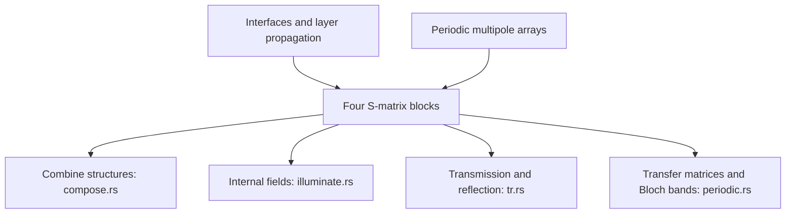

# Planar scattering matrices

This module describes planar and periodic structures with four S-matrix
blocks relating incoming and outgoing plane waves.

[interface.rs](interface.rs) computes interfaces and propagation;
[layers.rs](layers.rs) assembles layer stacks. [compose.rs](compose.rs)
combines structures through Redheffer composition.
[illuminate.rs](illuminate.rs) and [solve.rs](solve.rs) find fields between
stacks. [tr.rs](tr.rs) computes transmittance and reflectance,
[periodic.rs](periodic.rs) computes transfer matrices and Bloch bands, and
[array.rs](array.rs) converts periodic multipole scattering into plane-wave
blocks. [chirality.rs](chirality.rs) computes averaged chirality-density forms.

Each operation saves what its analytic gradient needs. Blocks index outgoing
direction first, then incident direction. [mod.rs](mod.rs) defines the side
and direction conventions, including the different port order used by
transmittance calculations.
