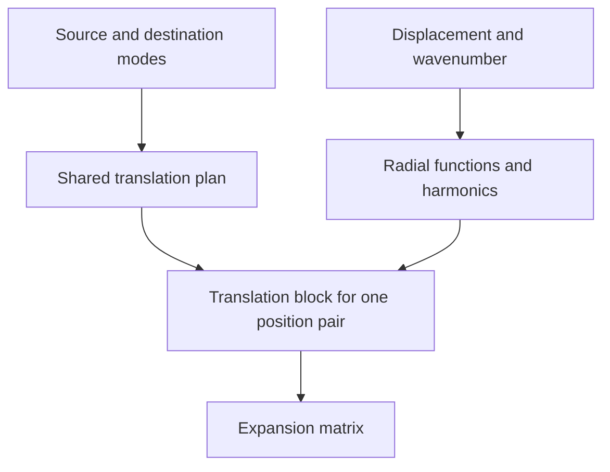

# Spherical waves

This module translates spherical waves between expansion centres, builds
expansion matrices, and converts a periodic spherical array to cylindrical waves.

- [mod.rs](mod.rs) defines the mode labels and basis.
- [coupling.rs](coupling.rs) computes Wigner couplings; [plan.rs](plan.rs) shares
  them across position pairs.
- [polar.rs](polar.rs) and [cartesian.rs](cartesian.rs) evaluate individual
  translation coefficients and their derivatives.
- [expansion.rs](expansion.rs) assembles ordinary and lattice expansion matrices.
- [periodic_to_cw.rs](periodic_to_cw.rs) handles the outgoing cylindrical expansion
  of a chain periodic along z.

Ordinary expansion matrices reuse mode couplings across position pairs. Each
pair needs its own radial functions and harmonics:

Matrices map source coefficients to destination coefficients. Ordinary
translations use `destination - source`; lattice sums use the opposite
displacement. Regular waves use spherical Bessel functions, and singular waves
use outgoing Hankel functions. See [mod.rs](mod.rs) for polarization conventions.
