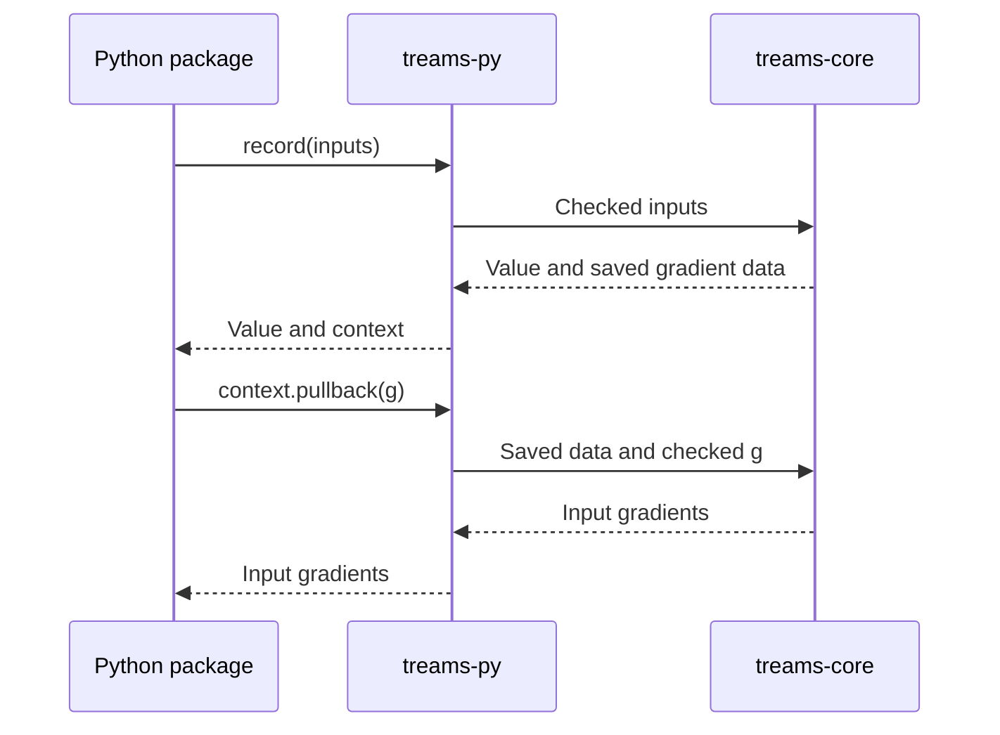

# Python bindings

This crate builds `treams_rs._native`. It converts Python values and NumPy
arrays into inputs for [treams-core](../treams-core/), then returns arrays and
objects that hold the data needed for gradients. Numerical kernels and their
analytic derivatives belong to the core; the [Python package](../../python/)
adds bases, materials and physical results.

| Files | Job |
|---|---|
| [`src/lib.rs`](src/lib.rs) | Export the native module; document binding conventions and how to add a function. |
| [`src/args.rs`](src/args.rs), [`src/convert.rs`](src/convert.rs) | Read arguments, check array shapes and convert between NumPy and Rust storage. |
| [`src/broadcast.rs`](src/broadcast.rs) | Apply recorded calculations across arrays and sum gradients over broadcast axes. |
| [`src/context.rs`](src/context.rs) | Hold gradient data, release the Python lock during native work and translate core errors. |
| [`src/ufunc/`](src/ufunc/) | Run core kernels through NumPy's array operations. |
| Other `src/*.rs` files | Bind the matching physics or numerical module in the core. |

A recorded calculation returns `(value, context)`. Calling
`context.pullback(g)` once gives input gradients from the gradient `g` with
respect to the value. The context owns its saved data and checks `g` before
consuming it. Every native call preserves subnormal floating-point values;
parallel work uses the core's thread pool.

The bindings check the shapes and lengths they read; the core checks numerical
domains. [`_native.pyi`](../../python/treams_rs/_native.pyi) declares the exports.
Tests in [`tests/bindings/`](../../tests/bindings/) cover that declaration,
gradient contexts, array layouts and NumPy behavior. The
[source map](../../docs/development/architecture.md) connects each binding to
its Python caller and physics tests.
