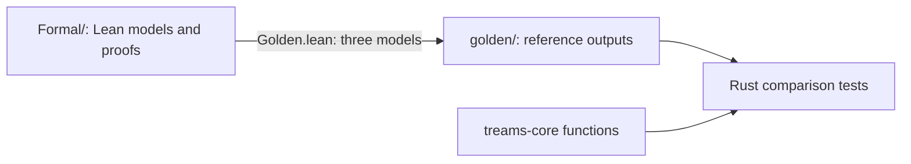

# Formal proofs

Lean 4 and Mathlib proofs about six kernels of `treams-core`: diffraction-order
enumeration, lattice shells, the translation-table index, the translation degree
loop and its Wigner 3j selection rules, LU equilibration and the pullback of the
requested-illumination solve. Each file under [`Formal/`](Formal) restates a Rust
algorithm as a Lean definition and proves properties of it over exact integers and
reals. Three Rust tests compare Rust functions with the model outputs in
[`golden/`](golden).



## Requirements

[elan](https://github.com/leanprover/elan), the Lean toolchain installer. The
toolchain version is pinned in [`lean-toolchain`](lean-toolchain).

## Check the proofs

```sh
just formal
```

Run it from the repository root. It downloads the prebuilt Mathlib cache, checks
every proof with warnings as errors, and checks that `golden/` matches the models.

The [formal proofs page](https://yaugenst.github.io/treams-rs/latest/design/formal-proofs/)
lists each Rust item with its Lean file and theorems, the tests that compare the
Rust code with the models, and what the proofs do not cover.
