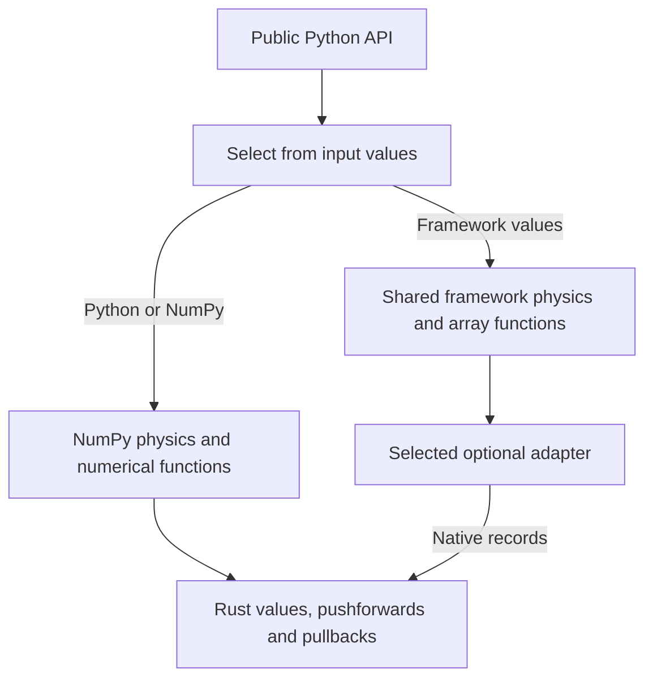

# Python package

`treams_rs` describes scattering problems in terms of bases, materials, waves
and matrices. It checks physical arguments, calls the
[Rust extension](../crates/treams-py/), and returns arrays or named physical
results. Numerical kernels and their analytic derivatives live in
[treams-core](../crates/treams-core/).

| Files in `treams_rs/` | Job |
|---|---|
| `__init__.py`, `__main__.py` | Public imports and command-line help. |
| `_bases.py`, `_modes.py`, `_material.py`, `_lattice.py`, `_polarization.py` | Mode labels, geometry, media and polarization conventions. |
| `_waves.py`, `_fields.py`, `_tmatrix.py`, `_cluster.py`, `_smatrix.py`, `_periodic.py` | Physical objects and particle, layer and periodic calculations. |
| `_array.py`, `_operators.py`, `_operator_objects.py`, `_results.py` | Arrays with physical metadata, operations on them and named results. |
| `special.py`, `lattice.py`, `sw.py`, `cw.py`, `pw.py`, `coeffs.py`, `ebcm.py`, `iterative.py`, `operators.py`, `misc.py` | Function namespaces for numerical and physics operations. |
| `diff.py`, `_records.py`, `testing.py` | Explicit JVPs and VJPs, shared derivative contracts and derivative checks. |
| `_dispatch.py`, `_promotion.py`, `_autodiff_functions.py` | Lazy input selection and constant promotion at the public API boundary. |
| `advect.py`, `jax.py`, `torch.py`, `autograd.py`, `_framework*.py` | Optional differentiation frameworks and their shared physics objects. |
| `_validation.py`, `_native.pyi`, `_upstream.py`, `_catalog.py` | Argument checks, native type declarations, treams name mapping and API documentation. |
| `parallel.py`, `io.py` | Thread controls and optional HDF5 file support. |

The ordinary API selects its backend from input values and defaults to NumPy.
`diff` returns a value and a context whose `pullback` computes input gradients
and whose `pushforward` maps input tangents to output tangents. Either action
consumes the context.
Advect, JAX, PyTorch and HIPS Autograd connect those
calculations to their own differentiation; `_framework*.py` keeps their
physical objects consistent. Continuous quantities stay in framework arrays,
while mode labels and cutoffs stay fixed. Native calculations run on the CPU
and support first-order forward and reverse differentiation. Higher derivatives
are unsupported. Frameworks and h5py are
imported only when selected or explicitly requested.

Python checks argument types and physical conventions; the bindings check
array shapes and the Rust core checks numerical domains. The
[source map](../docs/development/architecture.md) lists the owning files and
tests for each domain. [`tests/api/`](../tests/api/) checks public objects,
[`tests/autodiff/`](../tests/autodiff/) checks differentiation, and the other
test directories exercise the corresponding physics. See the
[project README](../README.md) for installation and examples.
